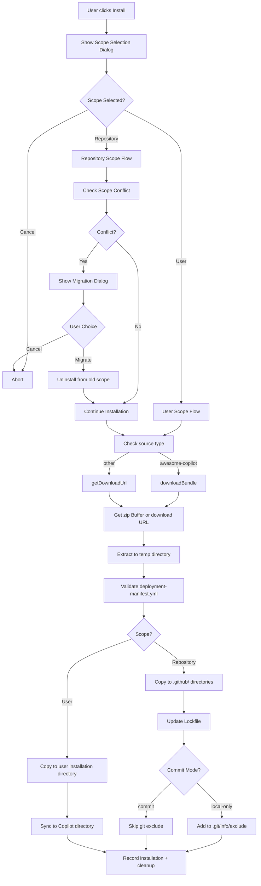
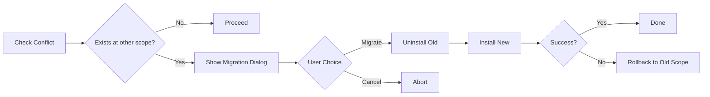
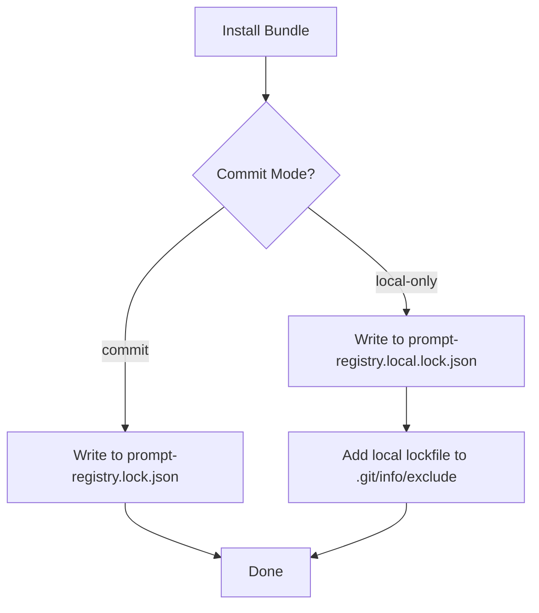
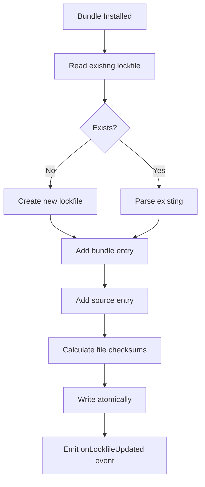
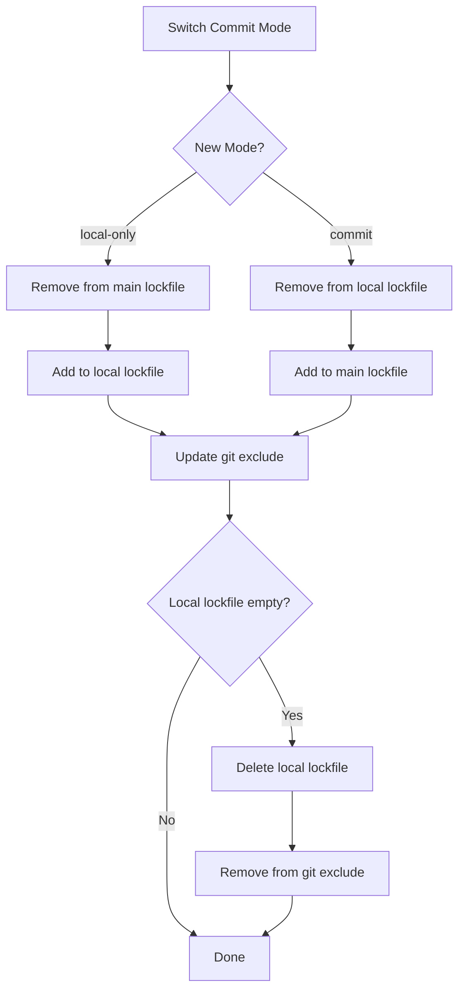
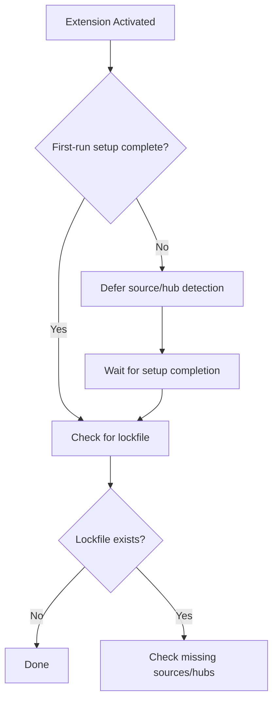
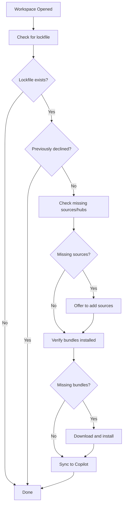

# Installation Flow

## Directory Structure

### User Scope

```
Extension Storage/
├── bundles/                          # Installed bundles
│   └── testing-automation/
│       ├── deployment-manifest.yml
│       └── prompts/
│           └── testing-prompt.prompt.md
└── registry.json                     # Sources and records

Copilot Directory (macOS)/
~/Library/Application Support/Code/User/prompts/
└── testing-automation/
    └── testing-prompt.prompt.md
```

### Repository Scope

```
your-repo/
├── .github/
│   ├── prompts/
│   │   └── my-prompt.prompt.md
│   ├── agents/
│   │   └── my-agent.agent.md
│   ├── instructions/
│   │   └── my-instructions.instructions.md
│   └── skills/
│       └── my-skill/
│           └── skill.md
├── .vscode/
│   └── mcp.json                      # MCP server configurations
├── prompt-registry.lock.json         # Main lockfile for committed bundles
└── prompt-registry.local.lock.json   # Local lockfile for local-only bundles (git-excluded)
```

## Installation Steps



## Scope Selection

When a user initiates installation, a QuickPick dialog presents three options:

| Option | Scope | Commit Mode | Description |
|--------|-------|-------------|-------------|
| Repository - Commit to Git (Recommended) | `repository` | `commit` | Tracked in version control |
| Repository - Local Only | `repository` | `local-only` | Excluded via `.git/info/exclude` |
| User Profile | `user` | N/A | Available everywhere |

Repository options are disabled when no workspace is open.

## Scope Conflict Resolution

A bundle cannot exist at both user and repository scope simultaneously. When installing a bundle that exists at another scope:

1. **Detection**: `ScopeConflictResolver.checkConflict()` checks both scopes
2. **Dialog**: User is prompted to migrate or cancel
3. **Migration**: If accepted, bundle is uninstalled from old scope first
4. **Rollback**: If installation fails, attempts to restore at original scope



## Repository Scope Installation

### File Placement

Files are placed in `.github/` subdirectories based on type:

| File Type | Target Directory |
|-----------|------------------|
| Prompts (`.prompt.md`) | `.github/prompts/` |
| Instructions (`.instructions.md`) | `.github/instructions/` |
| Agents (`.agent.md`) | `.github/agents/` |
| Skills | `.github/skills/<skill-name>/` |
| MCP Servers | `.vscode/mcp.json` |

### Git Exclude Management

For local-only mode, paths are added to `.git/info/exclude`:

```
# Prompt Registry (local)
.github/prompts/my-prompt.prompt.md
.github/agents/my-agent.agent.md
prompt-registry.local.lock.json
```

The local lockfile (`prompt-registry.local.lock.json`) is automatically added to `.git/info/exclude` when created and removed when deleted.

This file is local to the user's machine and not committed to Git.

## Lockfile Management

The `LockfileManager` singleton manages repository-scoped bundles using a dual-lockfile architecture:

| Lockfile | Purpose | Git Tracking |
|----------|---------|--------------|
| `prompt-registry.lock.json` | Committed bundles | Tracked (commit to Git) |
| `prompt-registry.local.lock.json` | Local-only bundles | Excluded via `.git/info/exclude` |

### Dual-Lockfile Architecture

Bundles are stored in separate lockfiles based on their commit mode:

- **Committed bundles** → `prompt-registry.lock.json` (shared with team)
- **Local-only bundles** → `prompt-registry.local.lock.json` (personal, git-excluded)

The commit mode is **implicit** based on which lockfile contains the bundle—no `commitMode` field is stored in bundle entries.



### Single Source of Truth

The lockfile is the **single source of truth** for repository-scoped bundles:

- `RegistryManager.listInstalledBundles('repository')` queries both lockfiles
- Repository-scoped installations only update the appropriate lockfile, not `RegistryStorage`
- User/workspace-scoped bundles continue to use `RegistryStorage`
- When listing bundles, `LockfileManager` merges entries from both lockfiles and annotates each with its commit mode

This prevents inconsistencies when lockfile or bundle files are manually deleted.

### File Existence Validation

When listing repository bundles, the extension validates that bundle files exist:

- If files are missing, the bundle is marked with `filesMissing: true`
- The UI shows a warning indicator for bundles with missing files
- Use the "Clean Up Stale Repository Bundles" command to remove stale entries

### Creation/Update



### Atomic Write

Lockfile writes use a temp file + rename pattern to prevent corruption:

1. Write to `prompt-registry.lock.json.tmp`
2. Rename to `prompt-registry.lock.json`

### Lockfile Schema

Both lockfiles use the same schema structure. The `commitMode` field is deprecated—commit mode is now implicit based on file location:

```json
{
  "$schema": "...",
  "version": "1.0.0",
  "generatedAt": "2026-01-14T10:30:00.000Z",
  "generatedBy": "prompt-registry@1.0.0",
  "bundles": {
    "bundle-id": {
      "version": "1.0.0",
      "sourceId": "github-a1b2c3d4e5f6",
      "sourceType": "github",
      "installedAt": "...",
      "files": [
        { "path": ".github/prompts/...", "checksum": "sha256..." }
      ]
    }
  },
  "sources": {
    "github-a1b2c3d4e5f6": { "type": "github", "url": "..." }
  },
  "hubs": {
    "b5c6d7e8a9f0": { "name": "My Hub", "url": "https://example.com/hub.json" }
  }
}
```

> **Note:** Existing lockfiles with `commitMode` field continue to work for backward compatibility. The field is ignored on read (file location determines mode) and not included in new entries.

### SourceId Generation

SourceIds uniquely identify sources in the lockfile. The format depends on the source origin:

| Source Origin | Format | Example |
|---------------|--------|---------|
| Hub source | `{type}-{12-char-hash}` | `github-a1b2c3d4e5f6` |
| Non-hub source | `{source.id}` | `my-local-source` |

For hub sources, the sourceId is generated using `generateHubSourceId(type, url)` from `src/utils/sourceIdUtils.ts`:

1. Normalize the URL (lowercase, remove protocol, remove trailing slashes)
2. Hash `{type}:{normalizedUrl}` using SHA256
3. Take the first 12 characters of the hex digest
4. Format as `{type}-{hash}`

This ensures:
- **Determinism**: Same source always produces the same ID
- **Portability**: SourceIds don't depend on hub configuration
- **Collision resistance**: 12 hex chars (48 bits) provides sufficient uniqueness

**Legacy format**: Older lockfiles may contain hub-prefixed sourceIds (`hub-{hubId}-{sourceId}`). These continue to work for backward compatibility—sources are resolved by matching the sourceId in the `sources` section.

### Hub Key Generation

Hub entries in the lockfile use URL-based keys instead of user-defined hub IDs:

```json
"hubs": {
  "b5c6d7e8a9f0": { "name": "My Hub", "url": "https://example.com/hub.json" }
}
```

The key is generated using `generateHubKey(url, branch?)`:
- Hash the normalized URL using SHA256
- Take the first 12 characters
- Append `-{branch}` if branch is not `main` or `master`

This makes lockfiles portable across different hub configurations.

### Commit Mode Switching

When switching a bundle between commit and local-only modes:



All bundle metadata (version, sourceId, files, etc.) is preserved during the move.

### Backward Compatibility and Migration

The dual-lockfile architecture maintains backward compatibility with existing lockfiles:

| Scenario | Behavior |
|----------|----------|
| Read lockfile with `commitMode` field | Field is ignored; file location determines mode |
| Write new bundle entry | `commitMode` field is not included |
| Update existing entry | Entry is rewritten without `commitMode` field |
| Local-only bundle in main lockfile | Continues to work; migrates on next modification |

**Migration path for existing lockfiles:**

1. Existing lockfiles with `commitMode` field continue to function normally
2. When a bundle is modified (updated, mode switched), the entry is rewritten without `commitMode`
3. Local-only bundles in the main lockfile remain there until explicitly switched to local-only mode
4. No automatic migration is performed—changes happen gradually as bundles are modified

**Conflict detection:**

If a bundle ID exists in both lockfiles (should not happen in normal operation), `LockfileManager.getInstalledBundles()` displays an error to the user and skips the duplicate entry from the local lockfile.

## Repository Activation

When a workspace with a lockfile is opened, the extension checks for missing sources and hubs. This detection is **deferred until first-run setup is complete** to avoid confusing users with source configuration prompts before they've configured the extension.

### Setup Timing



The `RepositoryActivationService` accepts a `SetupStateManager` dependency:
- If setup is incomplete, detection is deferred and logged
- If `SetupStateManager` is unavailable, detection proceeds (fail-open behavior)
- After setup completes, detection is triggered automatically

### Activation Flow



## AwesomeCopilot Flow

1. Fetch `collection.yml` from GitHub
2. Parse collection items
3. Fetch each prompt file (with auth)
4. Create `deployment-manifest.yml` (YAML)
5. Build zip archive in memory
6. Return Buffer to BundleInstaller

## Bundle Manifest

```yaml
# deployment-manifest.yml
version: "1.0"
id: "my-bundle"
name: "My Bundle"
prompts:
  - id: "my-prompt"
    name: "My Prompt"
    type: "prompt"
    file: "prompts/my-prompt.prompt.md"
    tags: ["example"]
```

## Key Components

| Component | Responsibility |
|-----------|----------------|
| `ScopeServiceFactory` | Returns appropriate scope service based on `InstallationScope` |
| `UserScopeService` | Handles user-level file placement and Copilot sync |
| `RepositoryScopeService` | Handles repository-level file placement and git exclude |
| `LockfileManager` | Manages lockfile CRUD operations |
| `ScopeConflictResolver` | Detects and handles scope conflicts |
| `RepositoryActivationService` | Handles lockfile detection on workspace open |
| `LocalModificationWarningService` | Detects local file changes before updates |
| `BundleScopeCommands` | Context menu commands for scope management |

## See Also

- [Adapters](./adapters.md) — URL vs Buffer installation
- [MCP Integration](./mcp-integration.md) — MCP server installation
- [Update System](./update-system.md) — Update checking and application
